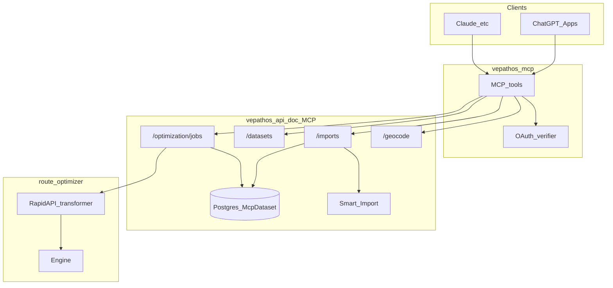
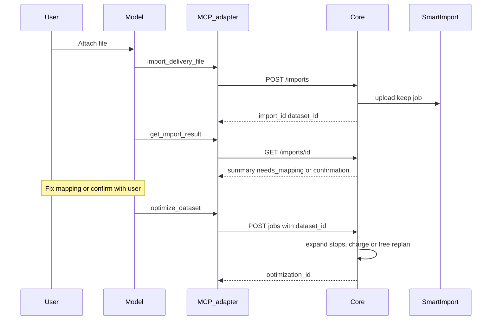
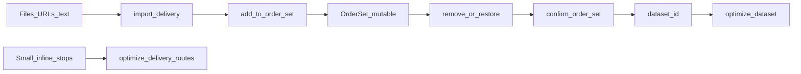

# MCP architecture: datasets today, working set tomorrow

> **Superseded (2026-09-16).** MCP runs became plans: see [architecture-mcp-plans.md](architecture-mcp-plans.md).
> The order set (sections 4, 5, 9, 10) was not built; datasets are import staging for plans, and free
> replans follow the plan rule shared with the dashboard. The rest is kept as history.

Design document only. No production behaviour ships from this file until a separate
implementation plan passes ChatGPT staging smoke ([smoke-prompts.md](smoke-prompts.md)).

**Decisions locked**

| Topic | Choice |
|---|---|
| Scope of this doc | Architecture + tentative contract (no code) |
| Working set ownership | Per Vepathos **account** in Core (`userId`), not per chat |
| Identity | Explicit `orderset_id` (`mcp_os_…`) on every mutate/read tool, optional human `label` |
| Storage | Postgres (Prisma) in api-doc. Nothing is kept in adapter or Core process memory |
| TTL | **48 h idle** — refreshed on every successful mutate and on confirm |
| MVP filters | `stop_ids[]`, structured `zone` / `city` / `postcode`, and `address_contains` as last resort. Accent- and case-insensitive. No geo polygons |
| Remove | **Soft** exclude with `dry_run` and `restore`. Never a hard delete in the MVP |
| Confirm | Materializes an immutable `dataset_id`; idempotent by content; then existing `optimize_dataset` |
| Billing | First optimize of a stop set charges and checks the plan. Free replans skip quota only, never plan limits |
| Prerequisites | Core P0 fixes (section 3) ship before any orderset code |

Related: [architecture.md](architecture.md), [core-channel-contract.md](core-channel-contract.md),
[large-payloads.md](large-payloads.md), [channel-defaults.md](channel-defaults.md),
[tools.md](tools.md).

---

## 1. System map



| Layer | Repo | Responsibility |
|---|---|---|
| Adapter | `vepathos-mcp` | Tools, input/output schemas, local preflight, OAuth PRM; **does not** parse Excel; stateless |
| Core channel | `vepathos-api-doc` `/api/mcp/v1` | Account gate, Smart Import bridge, `McpDataset` (Postgres), billing, expand `dataset_id` |
| Smart Import | `vepathos-smart-import` | File format, column mapping, geocode; jobs purged after `SMART_IMPORT_JOB_TTL_HOURS` (24 h) |
| Engine | `route-optimizer-app` via RapidAPI transformer | VRP; `min_stops` default 1; stop-band margin 0.8 warned, not forced |

---

## 2. Datasets (P1 — large payloads)

**Status (2026-09-16): not deployed.** Production today only has inline `optimize_delivery_routes`.

| Side | Where | State |
|---|---|---|
| Core | `src/server/mcp/datasets.ts`, `app/api/mcp/v1/imports/`, `app/api/mcp/v1/datasets/`, migration `20260916180000_mcp_datasets`, `dataset_id` branch of `optimization/jobs/route.ts` | Pushed to `develop` (`ce5bc03`). That commit fails `next build` (typecheck) and has the billing hole: **do not deploy api-doc** until the P0-1 fix commit is pushed on top |
| Core P0-1 fix | billing, typecheck, `GET /datasets/{id}`, migration `20260916210000_mcp_dataset_billed_at` | Pushed (`331a4c3`). Settlement fix for free replans (`billing.ts`) in working tree, not committed: **do not deploy without it** |
| Adapter 0.4.0 | `tools/import_tools.py`, `MCP_IMPORT_TOOLS_ENABLED`, dataset preflight | Committed locally (`fee0d88`), not pushed. `devtools/smoke_local_datasets.py` not committed |

~1 005 stops worked inline; ~8 200 did not (model argument budget), not the solver.



**File validation**

1. Adapter: attachment arrived? size? empty? URL SSRF-safe? → `INVALID_INPUT`.
2. Smart Import: parse + mapping → `needs_mapping` / `failed` / summary.
3. Model: chooses next tool from summary; does not “fix” the binary.
4. Optimize only when dataset status is ready.

**Billing**

- `MCP_CONFIRM_BEFORE_OPTIMIZE=false` in prod: one optimize call runs and charges; the model should still ask in chat.
- Free replans: per plan, `PlanLimits.freeReplansPerRun` (Free 1, Starter 1, Growth 2, Scale 3,
  Enterprise 5), shared with the dashboard. Was `MCP_FREE_REPLANS_PER_DATASET` (5) for every plan. The pushed commit `ce5bc03` applies them from the
  very first optimize of a new dataset and, while any remain, skips both the quota and the plan
  entitlement check. The P0-1 fix (section 3) bills the first run and keeps plan limits on replans.
- Import / geocode do **not** consume route-stop quota.

Shortcut (keep forever): single file, no edits → `import_*` → `optimize_dataset` without an orderset.

---

## 3. Core prerequisites (P0 — before any orderset code)

These change code that has not shipped yet. The inline `optimize_delivery_routes` path in production
does not go through any of them (it only activates when the body carries `dataset_id`).

| Item | Needed for | State (2026-09-16) |
|---|---|---|
| P0-1 Billing of datasets | Import tools 0.4.0 | **Implemented**, not committed (Core + adapter) |
| P0-1 Real preflight for `optimize_dataset` | Import tools 0.4.0 | **Implemented** (`GET /datasets/{id}`), not committed |
| `MCP_IMPORT_TOOLS_ENABLED` flag | Deploying 0.4.0 without publishing tools | **Implemented**, not committed |
| P0-2 Rows keep address fields and rows without coordinates | Orderset filters | Pending |
| P0-3 Ids namespaced per source | Orderset merge | Pending |
| P0-4 Retention cron | Storage hygiene (datasets today, ordersets later) | Pending |

### P0-1 Billing of datasets

- The **first** optimize of a stop set is charged and passes the plan entitlement check.
  *Implemented:* `McpDataset.billedAt` is set by the first run charged to the quota; the trial does
  not set it.
- A free replan skips the **quota only**. Plan limits (stops per request, features, fleet, stops per
  route) are always enforced, and a free replan never consumes the one-time trial. *Implemented.*
- Replans are claimed atomically (`updateMany … replanCount < N`), so concurrent requests cannot
  exceed the cap, and are given back when the request is rejected or never reaches the engine.
  *Implemented.*
- The replan counter belongs to a **lineage**: the imported dataset itself, or the orderset a dataset
  was confirmed from. Otherwise every confirm would hand out five new free optimizations.
  *Dataset lineage implemented; orderset lineage comes with ordersets.*
- A replan is free only when its stops are a subset of stops already billed in that lineage
  (exclusions, parameter changes, re-ordering). Adding stops charges again (phase 2: charge only the
  added stops). **Product decision to confirm.** A dataset variant can only exclude stops, so this
  holds for datasets by construction.
- `exclude_stop_ids` without `dataset_id`, and `stops` together with `dataset_id`, are
  `422 INVALID_INPUT` (before, `exclude_stop_ids` was accepted and ignored with inline `stops`,
  breaking “unknown fields are never silently ignored”). *Implemented.*
- Import and dataset views report `next_optimize_charged` and `free_replans_remaining` (0 until the
  first billed run); job responses report `billing.free_replans_remaining`. *Implemented.*
- Settlement follows the reservation. The local smoke (`devtools/smoke_local_datasets.py`) found that a
  free replan reserved without quota was still charged when it completed: `confirmRapidApiJob` /
  `releaseRapidApiJob` only recognised the trial as quota-free. `src/server/mcp/billing.ts` now holds
  the billing mode, and confirm, release, idempotent replay, job status and the result summary all read
  it. The summary's `charged_stops` is 0 for the trial and free replans, as the contract already said
  (before, trial results showed the served stops). *Implemented, after `331a4c3`.*
- Adapter: the `optimize_dataset` preflight reported `stops=0, charges_stops=0`, which told the user
  nothing was charged. It now reads `GET /datasets/{id}` and reports the real stops (minus
  `exclude_stop_ids`), `charges_stops` (0 on a free replan), the plan check against both, and warnings
  for runs Core would reject. *Implemented.*

**Known gaps found while implementing P0-1**

- A first run accepted by the engine and then failed (and refunded) still leaves `billedAt` set, so
  the next runs are free replans. Rare; fix by setting `billedAt` when the charged job completes.
- Fixed 2026-09-17: `use_time_windows=false` now sends Core `constraints.time_windows=false`, so the
  windows stay in the dataset for reference and the engine does not optimize by them. The same flag
  rule covers `use_weight` and `use_volume`.
- `flatCsvToStops` omits `weight_kg` / `volume_m3` when the value is 0 or absent, so a dataset with a
  single zero-weight row fails `use_weight` (“every stop needs weight_kg”). The preflight warns
  (`stops_without_weight`); Core should store an explicit 0 when the column is mapped.

### P0-2 Dataset rows keep what filters need

`McpStopRow` stores only `id, lat, lng, weight_kg, volume_m3, time_window`, and `flatCsvToStops`
drops every row without coordinates. Smart Import's `vepathos_flat_v1` already provides
`address`, `zone`, `city`, `region`, `postcode`.

- Materialize `address`, `zone`, `city`, `postcode` and `matched_address` per row.
- Keep rows without coordinates with status `needs_geo` instead of dropping them, and report the
  count in the import summary. Silent loss of rows is worse than an explicit count.

### P0-3 Ids that survive merging files

When a file has no id column, Core generates `row_${i}`. Two such files would collide on
`row_1`, `row_2`, … and a merge would overwrite one with the other.

- Generated ids are namespaced per source (e.g. `<source-short>:row_12`); `source_ref` keeps the
  original value for display.
- Within one file, a repeated `delivery_id` keeps summing packages (unchanged).

### P0-4 Retention of stored rows

Everything lives in Postgres: `McpDataset.stops` (JSONB) today, `McpOrderSet` later. Nothing is held
in process memory. Expiry is currently **lazy**: `findDatasetForUser` clears `stops` only when an
expired dataset is read again, so a never-revisited import keeps its rows (~0.5–1 MB per 8 000 stops).

- Add `GET /api/cron/mcp-dataset-retention` (same pattern as `mcp-map-retention`, `CRON_SECRET`),
  called from the `cron` container in `scripts/billing-cron.sh`:
  1. Clear `stops` / `summary` and set `status=expired` where `expiresAt <= now`.
  2. Delete dataset rows N days after expiry (kept N days for billing audit: jobs record `datasetId`).
  3. Delete expired orderset items and headers (no audit value) once ordersets exist.

---

## 4. Product gap: editable day plan

`McpDataset` is an **immutable snapshot** (TTL 24 h). It does not support well:

- several files into one delivery day
- “remove Palermo addresses” mid-conversation (the model never sees all rows, so it cannot build
  `exclude_stop_ids` for a textual criterion)
- list / edit **before** charging optimize

**Working set (`orderset`)** = mutable draft per account. **Confirm** freezes it into a
`dataset_id` and reuses the existing optimize + free-replan pipeline.



---

## 5. Working set design (account + TTL)

### Identity and lifetime

| Field | Decision |
|---|---|
| Id | `orderset_id` = `mcp_os_` + 32 hex; required on mutate/read tools |
| Label | Optional free text on create (e.g. “Reparto 17/09 zona norte”) so a set is recognisable from another chat |
| Owner | Core `userId` (same MCP gate as imports) |
| TTL | **48 h since last successful mutate or confirm** |
| Size | Max 25 000 items (engine job limit); `add` beyond it → `422 INVALID_INPUT` with `details.max_items` |
| Storage | Prisma in api-doc: `McpOrderSet` + child table `McpOrderSetItem` (indexed filters and counts; a JSON column would rewrite the whole blob on every edit) |
| Concurrency | Last-write-wins; responses include `updated_at` and weak `etag`; two chats sharing an id can overwrite — instructions tell the model to reuse one id per day |

Why not per-chat: ChatGPT does not give a reliable conversation id to MCP. An explicit
`orderset_id` already isolates sandboxes (create a second set). Account scope matches datasets
and free replans.

### Item shape (minimum)

```text
stop_id          string   required, unique within the set; generated ids namespaced per source
source_ref       string?  original id from the file, or row number when the file had none
address          string?  for filters and user talk
zone, city, postcode  string?  structured parts from Smart Import
matched_address  string?  from SI / geocode when present
lat, lng         number?  null → status needs_geo
weight_kg        number?
volume_m3        number?
time_window      {start, end}?   HH:MM
source           { import_id?, filename?, dataset_id? }
status           needs_geo | ready | excluded
```

`excluded` is a soft remove: the row stays, is counted, is skipped by confirm and can be restored.
There is no `pending` status: an item either has coordinates (`ready`) or not (`needs_geo`).

### Merge policy (add)

- Same `stop_id` with the same coordinates and address → duplicate, skipped, counted in `duplicates`.
- Same `stop_id` with different data → **conflict**. Default `on_conflict: "report"`: conflicting
  rows are not applied; the response lists `conflicts` (count + sample ≤ 5 showing both versions).
  The caller re-sends with `on_conflict: "replace"` or `"keep_both"` (incoming stored as
  `<source-short>:<id>`).
- Generated ids never conflict (P0-3).

### Plan settings (stored with the set)

A dataset holds *what* (stops); a run needs *how* (depot, date, departure, fleet, constraints). A new
chat today has to ask for all of it again. The order set is the plan of the day, so it keeps both:

- `settings`: `depot` (lat/lng + label), `date`, `route_start_time`, `time_zone`,
  `service_time_minutes`, `vehicles`, constraints. Set on create or with a settings update; defaults come
  from the account profile (see "Run parameters: three layers" in section 13).
- `confirm_order_set` freezes stops **and** settings; `optimize_dataset` on that dataset uses them unless
  the call overrides a field, and the run record (layer 1) stores what was actually used.
- The agent always states the depot it will use and its distance to the stops before optimizing.

### Confirm policy (MVP)

- Confirm includes only `status=ready` items and reports `skipped_needs_geo` and `excluded`.
  There is no `include_needs_geo` option: a stop without coordinates cannot be optimized.
- Empty ready set → `422 INVALID_INPUT`.
- Idempotent by content: when the ready set hashes the same as the last confirm (`datasetStopsHash`),
  return the same `dataset_id` with `reused: true`.
- The dataset records `orderset_id` as its lineage for free replans (P0-1).

---

## 6. Validation layers (principles)

| Layer | Who | What |
|---|---|---|
| 1 Transport | Adapter | Arrival, size, empty body, SSRF |
| 2 Parse | Smart Import | Format, mapping, row validity |
| 3 Working set | Core | Merge with conflict report, soft exclude / restore, counters |
| 4 Confirm | Core | Ready-only freeze → `McpDataset`, idempotent by content |
| 5 Optimize | Adapter + Core | Preflight rejects/warnings, entitlements, charge / free replan |

The model **routes** tools; it does not replace layers 2–4.

---

## 7. Billing and confirmation (desired)

| Moment | Charges plan stops? | Plan limits checked? |
|---|---|---|
| import / add / remove / restore / get orderset | No | — |
| `confirm_order_set` | No (freeze only) | — |
| First `optimize_dataset` of a lineage | **Yes** | Yes |
| Variant within the lineage, stops ⊆ billed stops, ≤ 5 | No (free replan) | Yes |
| Variant that adds stops | Yes | Yes |
| Technical `confirmed` gate | Off in prod until ChatGPT staging smoke (T19) | — |

Later (roadmap T20): technical confirmation only for large stop thresholds or variants of an
already-billed `stops_identity` — never the “preflight looks like a finished plan” pattern that
broke ChatGPT on 16/09.

---

## 8. What to reuse vs extend

**Reuse:** `McpDataset`, free replans (after P0-1), `optimize_dataset`, import/SI, `preflight_checks`,
`STOP_MARGIN_RATIO`, `matched_address`, `datasetStopsHash`, `mcp-map-retention` cron pattern,
contract docs, smoke gate.

**Extend (implementation phase):** P0 fixes; `McpOrderSet` + `McpOrderSetItem` + `/ordersets` routes;
four MCP tools; server instructions; pointers in `large-payloads.md` and `core-channel-contract.md`.

**Do not:** merge “enqueue” and “optimize” into one tool.

---

## 9. Tentative Core contract — `/api/mcp/v1/ordersets`

Same headers as the rest of the MCP channel (`X-Vepathos-MCP-Service-Key`, `Authorization`,
optional client label / trace). Bodies JSON. No account ids in the body. Core keeps granular routes;
the adapter composes them into four tools (section 10).

### `POST /ordersets`

Create an empty set. Body optional: `{ "label": "Reparto 17/09" }` (≤ 80 chars).

```json
{ "orderset_id": "mcp_os_…", "label": "Reparto 17/09", "expires_at": "…", "updated_at": "…", "etag": "…" }
```

`201 Created`.

### `GET /ordersets`

List active (non-expired) sets for the account. Query: `limit` (1–50, default 20).

```json
{
  "ordersets": [
    {
      "orderset_id": "mcp_os_…",
      "label": "Reparto 17/09",
      "total": 4200,
      "ready": 4100,
      "needs_geo": 80,
      "excluded": 20,
      "expires_at": "…",
      "updated_at": "…"
    }
  ]
}
```

### `GET /ordersets/{orderset_id}`

Summary only — **never** all rows.

```json
{
  "orderset_id": "mcp_os_…",
  "label": "Reparto 17/09",
  "expires_at": "…",
  "updated_at": "…",
  "etag": "…",
  "counts": {
    "total": 4200,
    "ready": 4100,
    "needs_geo": 80,
    "excluded": 20,
    "with_weight": 4100,
    "with_volume": 0,
    "with_time_window": 1200
  },
  "sources": [{ "filename": "zona-norte.xlsx", "import_id": "…", "added": 2000 }],
  "sample": [ { "stop_id": "A1", "address": "…", "zone": "…", "status": "ready" } ],
  "last_confirmed_dataset_id": "mcp_ds_…"
}
```

`sample` ≤ 5. The `with_*` counts let the agent warn before optimize: a set mixing a file with
weights and one without fails `use_weight` (“every stop needs weight_kg”).

### `POST /ordersets/{orderset_id}/add`

```json
{ "import_id": "…", "on_conflict": "report" }
```
or
```json
{ "dataset_id": "mcp_ds_…" }
```

Refreshes TTL. `422` if the import/dataset is not ready. Does not charge stops.

```json
{
  "added": 1980,
  "duplicates": 12,
  "needs_geo": 8,
  "conflicts": { "count": 3, "sample": [ { "stop_id": "ORD-7", "current": { "address": "…" }, "incoming": { "address": "…" } } ] },
  "counts": { "total": 4200, "ready": 4100, "needs_geo": 80, "excluded": 20 },
  "expires_at": "…"
}
```

### `POST /ordersets/{orderset_id}/remove`

Soft exclude. At least one filter.

```json
{
  "stop_ids": ["A1", "A2"],
  "zone": "palermo",
  "city": null,
  "postcode": null,
  "address_contains": null,
  "dry_run": true
}
```

`zone` / `city` / `postcode` match whole values; `address_contains` is a substring on `address` and
`matched_address`. All comparisons are case- and accent-insensitive (`Núñez` = `nunez`). Filters
combine with AND; `stop_ids` is OR'd with the rest.

```json
{
  "dry_run": true,
  "matched": 312,
  "excluded": 0,
  "sample": [ { "stop_id": "B17", "address": "Gurruchaga 1234", "zone": "Palermo" } ],
  "counts": { "total": 4200, "ready": 4100, "needs_geo": 80, "excluded": 20 },
  "expires_at": "…"
}
```

With `dry_run: false`, `excluded` = rows newly excluded. Refreshes TTL.

### `POST /ordersets/{orderset_id}/restore`

Same filter body as `remove`; turns matching `excluded` rows back to `ready` / `needs_geo`.

### `POST /ordersets/{orderset_id}/confirm`

Freeze ready items into a `McpDataset` (status ready, TTL 24 h like other datasets). Refreshes TTL.

```json
{
  "dataset_id": "mcp_ds_…",
  "reused": false,
  "stops": 4100,
  "skipped_needs_geo": 80,
  "excluded": 20,
  "next_optimize_charged": true,
  "free_replans_remaining": 5,
  "expires_at": "…"
}
```

`next_optimize_charged` tells the agent what to say before `optimize_dataset`: `true` when this
lineage has not been billed yet or the stop set adds stops; `false` when the next run is a free replan.

### Error codes (additions)

| HTTP | code |
|---|---|
| 404 | `ORDERSET_NOT_FOUND` (unknown id or another account) |
| 410 | `ORDERSET_EXPIRED` (owned set past TTL: rebuild from the files) |
| 422 | `INVALID_INPUT` (empty confirm, no filter, import not ready, over 25 000 items) |
| 409 | `ORDERSET_CONFLICT` (phase 2, strong `If-Match`) |

---

## 10. Tentative MCP tools

Four tools, not seven: each added tool dilutes tool selection, and ChatGPT routing is what broke on 16/09.

| Tool | Role | Read-only |
|---|---|---|
| `add_to_order_set` | Without `orderset_id` creates the set (optional `label`); merges an `import_id` or `dataset_id`; `on_conflict` | no |
| `remove_from_order_set` | Soft exclude by filters; `dry_run`; `restore: true` undoes | no |
| `get_order_set` | With `orderset_id`: summary + sample. Without: list active sets | yes |
| `confirm_order_set` | → `dataset_id` (reused when unchanged) + whether the next optimize charges | no |

Then existing: `optimize_dataset(dataset_id, …)`. No `clear` tool: start a new set instead.

### Instructions (product rules to add when implementing)

1. Multi-file or “edit then optimize” → create/reuse an order set; never paste thousands of rows.
2. Single file, no edits → import → `optimize_dataset` shortcut is fine.
3. After each import, `get_import_result`; if `needs_mapping` / `needs_confirmation`, fix or ask before add.
4. Report `conflicts` to the user and ask before `replace` / `keep_both`.
5. Remove with `dry_run: true` first, show `matched` and the sample, then apply.
6. After add/remove, tell the user the counts (including `needs_geo` and the `with_*` counts) before confirm.
7. Confirm does not charge; use `next_optimize_charged` to say whether optimize charges or is a free replan.
8. Pass the same `orderset_id` every turn; do not create a second set unless the user wants a parallel draft.

---

## 11. Tool matrix: current vs future

| Tool | Status after orderset ships |
|---|---|
| `optimize_delivery_routes` | Keep — small inline plans |
| `get_optimization_result` | Keep |
| `import_delivery_file` / `_text` | Keep — feed SI + orderset add |
| `get_import_result` / `update_import_mapping` | Keep |
| `list_datasets` | Keep — frozen snapshots |
| `optimize_dataset` | Keep — target after confirm or direct import |
| `geocode_addresses` / `get_geocode_result` | Keep |
| `get_account` / `list_fleet` | Keep |
| `create_optimization_map` | Keep (flag) |
| Orderset tools (section 10) | **Add** four — nothing deprecated in v1 |

---

## 12. Acceptance criteria — implementation MVP (next plan)

Must pass before prod:

1. **Multi-file merge:** two imports into one `orderset_id`; `total` = sum − `duplicates`; conflicting
   ids are reported, not overwritten.
2. **Files without ids:** two files with no id column merge with no row lost or overwritten.
3. **Filtered remove:** `zone=palermo` with `dry_run` reports `matched` and a sample; applying it
   excludes exactly those rows on fixture data (checked for false positives, not only `> 0`);
   `restore` brings them back.
4. **Confirm → optimize:** confirm 100 ready stops → `optimize_dataset` succeeds; no charge on confirm;
   the **first** optimize is charged and plan limits are enforced; an exclusion-only variant is a free
   replan; a variant that adds stops is charged.
5. **Idempotent confirm:** confirming twice without changes returns the same `dataset_id`.
6. **Plan limits hold:** a Free account cannot optimize a dataset above its stops-per-request limit,
   first run or replan.
7. **Shared account:** two clients with same user + same `orderset_id` see the same summary after add.
8. **TTL:** after idle past 48 h, `GET` → `410 ORDERSET_EXPIRED`; another account's id → `404`;
   mutate and confirm refresh expiry.
9. **Retention:** after the cron runs, expired datasets hold no `stops` and expired orderset items are gone.
10. **No row dump:** no orderset response returns more than 5 full items.
11. **ChatGPT staging:** cases in [smoke-prompts.md](smoke-prompts.md) extended with multi-file + remove + confirm; recorded in compatibility matrix (T19).
12. **Regression:** inline `optimize_delivery_routes` unchanged; import → `optimize_dataset` shortcut green in adapter contract tests.

**Already automated for datasets (P0-1):** the dataset side of criteria 4 and 6 —
`tests/contract/test_import_tools.py` (first run charged, variant free, free replan still rejected
above the plan limit, preflight with real stops and charge, warnings for runs Core would reject) and
api-doc `tests/unit/mcp/datasets.test.ts` / `validate.test.ts`. The Core route's claim/release path has
no route-level test yet: verify it in the local stack before deploying.

### Rollout order

1. Core P0-1 deployed first (fix commit on top of `ce5bc03`). Inert for production traffic: nothing
   sends `dataset_id` yet. The migration only adds a table and a nullable column.
2. Adapter 0.4.0 with import tools behind `MCP_IMPORT_TOOLS_ENABLED` (default off, like
   `MCP_MAP_SHARES_ENABLED`), so deploying the code does not expose them. *Flag implemented.*
3. Turn the flag on locally / on staging, run the ChatGPT smoke (T19), then in prod.
4. P0-2, P0-3 and P0-4, then orderset routes and tools, in the same order.
5. Results by reference (section 13): P2-1 map preference first (description + flag), P2-2 export
   after P0-2.
6. Run parameters (section 13): account profile with depots (layer 2), then plan settings on the order
   set (layer 3, with the order set MVP). Server-side fleet sizing with the engine request profiles.

### Phase 2 (explicitly out of MVP)

- Geo filters (bbox / barrio polygons).
- Strong `If-Match` / `ORDERSET_CONFLICT`.
- Geocode-from-orderset batch (needs_geo → ready).
- Charging only the stops a variant adds, instead of the whole set.
- Web app sync of the same `McpOrderSet`.
- Longer persistence (account drafts for days/weeks).

---

## 13. Results by reference (P2)

The import path keeps thousands of rows out of tool **arguments**. Results need the same rule for tool
**outputs**.

### Evidence (2026-09-16, local stack, 10,931 stops, 135 routes)

Asked for "the map", Claude Code built its own page: it paged `get_optimization_result detail=stops`
eleven times (~300k tokens of rows), joined coordinates from the source file, wrote a 479-line HTML
page and screenshotted it — several minutes for something Core already renders.
`create_optimization_map` was not offered: `MCP_MAP_SHARES_ENABLED=false` in the local adapter (Core
and the map web client were ready).

### P2-1 Prefer the server map

- `create_optimization_map` description: say it renders every route and stop server-side in one call
  and is the way to show a plan on a map; never rebuild a map from `detail=stops` pages. Keep the
  existing warning that anyone with the link can view it (a client-built artifact can be private; the
  agent should say which one it offers).
- `get_optimization_result` description: `detail=stops` is for reading a route or a few pages, not for
  exporting a whole plan of hundreds+ stops.
- Enable `MCP_MAP_SHARES_ENABLED` wherever the import tools are enabled, and verify the snapshot with a
  10k-stop plan (per-route geometry cap is 100,000 points; total page weight untested).

### P2-2 `export_optimization_result`

Core builds the file and returns a link; rows never pass through the model.

| | |
|---|---|
| Input | `optimization_id`, `format` (`csv` \| `xlsx` \| `geojson`), `granularity` (`stops` \| `routes`), `language` |
| Stops rows | route, sequence, stop id, arrival time, lat/lng, address and the source columns kept by the dataset (P0-2), weight/volume |
| Route rows | vehicle, stops, distance, duration, departure and return clock time |
| Output | `{ export_id, url, expires_at, rows, columns }`, signed URL, 24 h, same account only |
| Billing | none |
| Limits | dataset jobs: complete. Inline jobs: Core keeps only stop ids and depot, so no coordinates unless inline stops start being stored |
| Retention | files deleted at expiry by the P0-4 cron |

Core route: `POST /api/mcp/v1/optimization/jobs/{job_id}/exports`. Needs P0-2 for addresses.
Acceptance: a 10k-stop dataset exports in one tool call, with row count equal to assigned stops, and
the model output for the call stays under a few hundred tokens.

### Run parameters: three layers

Defaults are dynamic, but every run keeps a snapshot of what it used, so changing a profile never
changes yesterday's plan or the base of its free replans.

1. **Run record (immutable), implemented 2026-09-16.** Core stores every parameter of each MCP
   optimization except the stops (`requestPayload.run`: depot, vehicles, schedule, objective, dataset,
   excluded count). `get_optimization_result` returns it as `request`; `list_datasets` returns the
   dataset's `last_run`. A new chat can repeat or vary the last run instead of asking for everything.
2. **Account profile (dynamic defaults), pending.** Named depots (geocoded, one default), departure
   time, service time and time zone. api-doc `UserPreference.savedConfigJson` already stores departure,
   service time and tolerances (used only by router-client) but no depot. Exposed to the agent (e.g. in
   `get_account` or a `list_depots` tool) so it proposes them and confirms instead of asking. This is the
   "account" layer of the engine request profiles in [channel-defaults.md](channel-defaults.md).
3. **Plan settings on the order set, pending** — see section 5, "Plan settings".

### Free replans per plan (decided 2026-09-16)

Free variants after a billed run: **Free 1, Starter 1, Growth 2, Scale 3, Enterprise 5**; channel plans
(RapidAPI, Shopify) 0. Stored in `PlanLimits.freeReplansPerRun` (migration
`20260916230000_plan_free_replans_per_run`, seeded from `lib/optimization/free-replans.ts`), read by
`resolveFreeReplansPerRun(userId)` straight from the user's plan row (the billing overview maps channel
plans to "free").

- **MCP datasets: implemented.** Claims, `next_optimize_charged` and `free_replans_remaining` use the
  plan's value; `MCP_FREE_REPLANS_PER_DATASET` is gone. A downgrade clamps remaining replans at 0.
- **Dashboard: decision pending.** Findings:
  1. Persisted plans (server) grant **no** free replans since commit `55dfc21` (2026-09-15): every launch
     is `billed`. The `>= 6` checks in `optimization-plan-lot.ts:26` and
     `optimization-plan-settlement.ts:108` only guard old `free_replan` launches.
  2. Legacy mode (`NEXT_PUBLIC_PERSISTED_PLANS_ENABLED=false`, which the production env examples set)
     still re-queues the live lot for free, capped only in the browser by `FREE_REPLAN_LIMIT = 5`
     (`vepathos-router-client/lib/optimization/free-replan.ts`). The server does not enforce it.
  3. Restoring free replans in persisted mode is a design change: billed runs now close their group as
     `confirmed`, and settlement rejects a free replan whose group is not `testing`, so the result would
     be discarded. It also needs the allowance stored on the launch at begin (a downgrade mid-run must
     not break it) and the `successfulOptimizeCount BETWEEN 0 AND 6` constraint relaxed.
  4. Copy: `previousPlansHint` hardcodes "hasta 5 veces" (en/es/pt); the replan banners interpolate
     `{limit}` without plural forms, which reads wrong for 1.

### Fleet that cannot cover the stops

When the account's vehicles cannot serve every stop within `max_stops`, the agent states how many
vehicles are needed and asks whether to **increase the vehicle count automatically to cover the
demand** (same vehicle types). It must not present it as a "test" or "hypothetical" fleet: the user
is planning a real day with more units. Implemented in the server instructions (2026-09-16).
Pending: a server-side option (e.g. `fleet_sizing: "cover_demand"`) that computes the count with the
0.8 stop margin and returns it in the run record, so the number does not depend on the model's math.

### Correctness issues seen in the same run (verify before P2)

1. **Depot ~170 km from every stop.** The request used depot 59.778, 14.94091 (engine tag
   `SELJUSNARSBERGSKOMMUN`); the stops sit around 58.5–58.6°N, 13.0–13.5°E. Each route drove
   350–400 km of deadhead (76,248 km total, 13–16 h routes). Where the depot came from in the
   conversation is unknown; instructions already forbid depots the user did not give.
2. **The distance guard did not fire.** The contract promises `INVALID_COORDINATES` for stops beyond the
   preprocessing radius (100 km for API channels), but Core never returns that code and the engine
   routed all 10,931 stops. Add a check (Core or preflight: depot to dataset centroid / farthest stop)
   and fix the contract text until it exists.
3. **Arrival times ignore the drive from the depot.** First arrivals were ~08:12 for an 08:05 departure
   170 km away. Check how the engine anchors `arrival_time`, together with the start-time encoding
   mismatch in [channel-defaults.md](channel-defaults.md) (routehub UTC vs api-doc local).

---

## 14. Out of scope here

Application code, Prisma migrations, deploy runbooks, Connect-loop cron, OAuth scope split (already
documented), other-repo inventory. Implementation = a separate plan/PR after this design is accepted.
