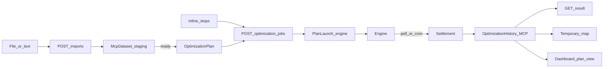

# MCP runs are plans

Decided 2026-09-16. Replaces an earlier order-set design (a mutable per-account draft merging
several imports into a dedicated optimize tool) that was superseded before anything from it was built.

**Decisions**

| Topic | Choice |
|---|---|
| Unit of work | `OptimizationPlan`, the same object the dashboard uses. Every MCP optimization creates or uses one |
| Runs | A plan launch (`OptimizationPlanLaunch`, transport `engine`) → execution → `OptimizationHistory` (source `MCP`) |
| Datasets | Import staging only. Once ready, their stops load into a plan (`dataset.plan_id`) |
| Billing | One rule for dashboard and MCP, in api-doc `src/server/billing/` |
| Free retries | By subscription: Free 1, Starter 1, Growth 2, Scale 3, Enterprise 5 (channel plans 0). Same stops or fewer (id + coordinates), within 24 h of the billed run |
| Library | Free 3 plans. Kept + favorite plans ≤ library size − 1, so one slot always rotates |
| Full library | An agent replaces the oldest unprotected plan itself and says which. If every slot is protected, the plan is temporary (outside the library; retention drops it) |
| Results | Read from the plan's history run: they no longer expire with the engine session |
| Sharing | The user chooses: open the plan in the account (login) or a temporary public link (48 h). The link is built from the history run, so dashboard runs share the same way |

## 1. Flow



1. **Import** (`POST /imports`, optional `plan_id`). When Smart Import finishes, the stops (with their address)
   load into the named plan (its stops replaced; depot, fleet and settings kept) or into a new plan named after
   the file. The import view reports `plan_id`, `plan_replaced`, `plan_temporary`, `account_url`.
2. **Optimize** (`POST /optimization/jobs`) takes exactly one of `plan_id`, `dataset_id` or inline `stops`:
   - `plan_id`: the plan's draft stops, minus `exclude_stop_ids`.
   - `dataset_id`: the dataset's copy of the stops (24 h), minus `exclude_stop_ids`, into the dataset's plan.
   - `stops`: a new plan (`plan_name`, default "Optimization YYYY-MM-DD").
   Optional `depot_name` names the depot in the plan (default "Depot").
   The run's depot, fleet and schedule are written to the plan draft, then a launch begins with the stops that
   run. `exclude_stop_ids` applies to that run only: the plan keeps all its stops. The launch decides the charge
   (section 2). Plan limits are checked before; the quota after the launch.
3. **Settlement.** The first read that sees the job complete (status, result or map), or the
   `mcp-plan-settlement` cron (every 2 min) for jobs nobody polls, settles the launch with the dashboard's
   settlement: history run (routehub-v1 routes + encoded road lines), execution confirmed, usage event,
   job reservation confirmed — one transaction. A job that fails, expires, is cancelled or goes stale
   releases its reservation and closes the launch in the same transaction.
4. **Results** come from the history run. `expires_at` is `null` for them.

## 2. Billing (api-doc `src/server/billing/`)

| Module | What |
|---|---|
| `free-retry-policy.ts` | `decideLaunchBilling` (at launch begin, both channels), `freeRetryState` (views), `freeRetryStillGranted` (settlement) |
| `stop-ledger.ts` | Reserve/confirm/release steps, usage counters, account pool lock, quota-free billing modes |
| `admission.ts` | Plan limits: null = unlimited, every number (0 included) is a hard cap; unreadable billing refuses the run |

**Free retry rule.** A plan's completed billed launch opens a 24 h cycle. A new launch of that plan is
`free_replan` when every stop is in the billed run (same `clientStopId` and coordinates rounded to 5 decimals)
and fewer completed free launches than `PlanLimits.freeReplansPerRun` belong to the cycle. Depot, fleet and
settings may change. A failed billed run opens no cycle; a failed free retry does not use the allowance.
The allowance is frozen on the launch (`freeReplansAllowed`) and re-checked at settlement.

A free retry waives the quota only; plan limits still apply. Its job row is reserved with
`billing: "plan_free_retry"` and settles charging 0.

**Wire fields** (plan, dataset and import views; quota rejections under `details.free_retry`):

```json
{
  "next_optimize_charged": false,
  "free_retries_allowed": 1,
  "free_retries_remaining": 1,
  "free_retry_window_ends_at": "2026-09-17T12:00:00.000Z",
  "charged_because": "stops_changed"
}
```

`charged_because` (only when charged): `no_allowance`, `no_billed_run`, `window_closed`, `allowance_used`,
`stops_changed`.

## 3. Core endpoints (`/api/mcp/v1`)

Same headers as the rest of the channel. New or changed fields only.

### `POST /imports`
Body adds optional `plan_id` (404 `PLAN_NOT_FOUND`). Response adds `plan_id` (null until the stops load).

### `GET /imports/{import_id}`, `GET /datasets`, `GET /datasets/{dataset_id}`
Add `plan_id`, `account_url`, the free-retry fields, and when the load rotated the library:
`plan_replaced: {id, displayName}` or `plan_temporary: true`. Removed: `free_replans_remaining`.

### `GET /plans?limit=20&query=`
```json
{
  "plans": [ /* plan view, below */ ],
  "library": { "plans_in_library": 3, "max_plans": 3, "kept_plans": 2, "max_kept_plans": 2 }
}
```
`max_plans` / `max_kept_plans` are null when unlimited. `revision` changes whenever the plan's stops or
settings change: a client that derives idempotency keys from its arguments should include it, because Core
replays by key (the same key returns the first job even if the plan changed since).

### `GET /plans/{plan_id}`
Plan view plus `last_agent_run` (the MCP parameters it last ran with, or null):
```json
{
  "plan_id": "cmf…", "name": "zona-1", "created_by": "agent", "temporary": false, "kept": false, "favorite": false,
  "revision": 7, "stops": 10931, "stops_not_optimizable": 0, "total_weight_kg": 21862.5, "total_volume_m3": null,
  "with_weight": 10931, "with_volume": 0, "with_time_window": 0,
  "depot": { "name": "Depot", "lat": -34.6, "lng": -58.4 }, "optimizing": false,
  "last_run_history_id": "cmf…", "last_run_at": "…", "account_url": "https://…/dashboard?tab=plans&plan=…&history=…",
  "created_at": "…", "updated_at": "…",
  "next_optimize_charged": true, "free_retries_allowed": 1, "free_retries_remaining": 0, "free_retry_window_ends_at": null,
  "charged_because": "no_billed_run"
}
```

### `POST /optimization/jobs`
Body: one of `plan_id` | `dataset_id` | `stops`; optional `exclude_stop_ids` (with plan/dataset), `plan_name`,
`depot_name`. Response adds:
```json
{
  "plan_id": "cmf…", "plan_name": "zona-1", "account_url": "…",
  "plan_replaced": { "id": "…", "displayName": "Lunes" },
  "plan_temporary": true,
  "billing": { "mode": "plan | plan_free_retry | mcp_full_trial", "quota_charged": true,
               "stops_remaining_this_period": 950000, "free_retries_remaining": 1 }
}
```
`free_retries_remaining`: retries that stay free after this run completes. New errors:
`404 PLAN_NOT_FOUND`, `409 PLAN_BUSY` (retryable, `Retry-After: 30`: the plan is optimizing),
`422 INVALID_INPUT` (plan without stops, stops with ids an agent cannot use, paused plan).

### `GET /optimization/jobs/{job_id}` and `/result`
Add `plan_id`, `account_url`; a settled plan job adds `history_id` (status also `completed_at`), has
`expires_at: null` and never answers 410.

### `POST /optimization/jobs/{job_id}/map`
Unchanged contract. For plan jobs the share is the history run's share (the same link the dashboard gives).

## 4. Dashboard (api-doc `/api/dashboard/optimization`)

| Endpoint | Change |
|---|---|
| `GET /plans` | Records add `source` (`WEB_CLIENT` / `MCP`), `isTemporary`. Adds `protectedCount` (library view), `maxSavedPlans`, `maxProtectedPlans` (both views) |
| `GET /plans/{id}` | Adds `billing: {nextOptimizeCharged, freeRetriesAllowed, freeRetriesRemaining, windowEndsAt, blocker}` for the draft's stops |
| `GET /plans/{id}/billing` | `{workspaceRevision, billing}` without the draft (stop keys read in SQL); `ETag` = revision |
| `POST /plans/{id}/launches` | Returned launch `kind` is `billed` or `free_replan` (with `billingCycleLaunchId`, `freeReplansAllowed`). A free launch's lot reserves nothing |
| `POST /plans`, `PATCH /plans/{id}/metadata`, `POST /plans/{id}/reuse` | `409 plan_protected_limit_reached {limit, count, maxSavedPlans}` when keeping/favoriting past the cap. `plan_limit_reached.details.oldest` is the oldest *replaceable* plan; when null, `details.blockedBy` is `protected` (every plan kept/favorite) or `optimizing` |
| `GET/POST/DELETE /history/{id}/map-share` | Temporary public link of a published run: `{state: "active", map_url, expires_at, access, notice}`; GET also `expired` / `revoked` / `share: null`; POST 409 unpublished, 410 expired or revoked, 503 unavailable |

## 5. Rollout

1. api-doc: migration `20260917090000_mcp_plans_unification` (enum `MCP`, plan `source`/`isTemporary`, launch
   `transport`/`billingCycleLaunchId`/`freeReplansAllowed`, dataset `planId` (drops `billedAt`/`replanCount`),
   map share `historyId`; data: Free `maxSavedPlans = 3`), then `20260917120000_plan_free_retries_by_tier`
   (`freeReplansPerRun` Free 1, Starter 1, Growth 2, Scale 3, Enterprise 5). Cron `mcp-plan-settlement`.
2. **Persisted plans must be on** (`PERSISTED_PLANS_ENABLED`, `NEXT_PUBLIC_PERSISTED_PLANS_ENABLED`): the MCP
   writes plans regardless, but the dashboard only shows them, and only applies the shared rule, in persisted
   mode. The legacy flow keeps its browser-side retries (now 1) until it is removed.
3. Adapter: tools take and report `plan_id`; `list_plans`; results and maps as above.
4. Dashboard: library caps, free-retry indicator, temporary map link, agent-created plans.

## 6. Tests

- api-doc unit: `tests/unit/billing/*`, `tests/unit/mcp/plan-workspace.test.ts`, `tests/unit/plan-quota.test.ts`.
- api-doc Postgres (CI job `plan-db`): `scripts/test-mcp-plans-postgres.ts` — billed run → free retry → billed;
  failed runs unlock; added stops charge; dashboard launches follow the same rule; library rotation, protected
  cap, temporary plans and their retention; history map share once per run.
